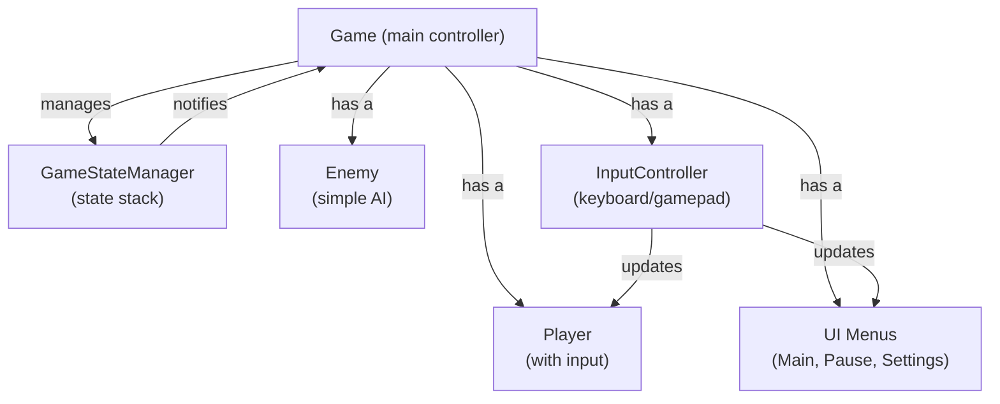

## 01 - Game Architecture Overview

### High-Level Overview

Thorns is built on a state-machine architecture using SFML for rendering. The game manages distinct states (MainMenu, Playing, Paused, Settings, GameOver) with a dedicated state manager that handles transitions.
### Core Architecture Components

  

### Key Responsibilities

- **Game.cpp**: Main game controller, processes events, delegates updates based on state

- **GameStateManager.cpp**: Manages state transitions (push/pop/change)

- **InputController.cpp**: Abstracts keyboard and gamepad input

- **Player.cpp**: Player entity with state machine (Idle/Walk/Sprint)

- **Enemy.cpp**: Enemy entity with basic downward movement

- **Menu.cpp / SettingsMenu.cpp**: UI management and interaction

### Window & Resolution

- Default: 1920x1080 @ 32-bit

- Supported resolutions: 1280×720, 1600×900, 1920×1080, 2560×1440, 3840×2160

- Configurable fullscreen toggle

- Dynamic layout updates when resolution changes