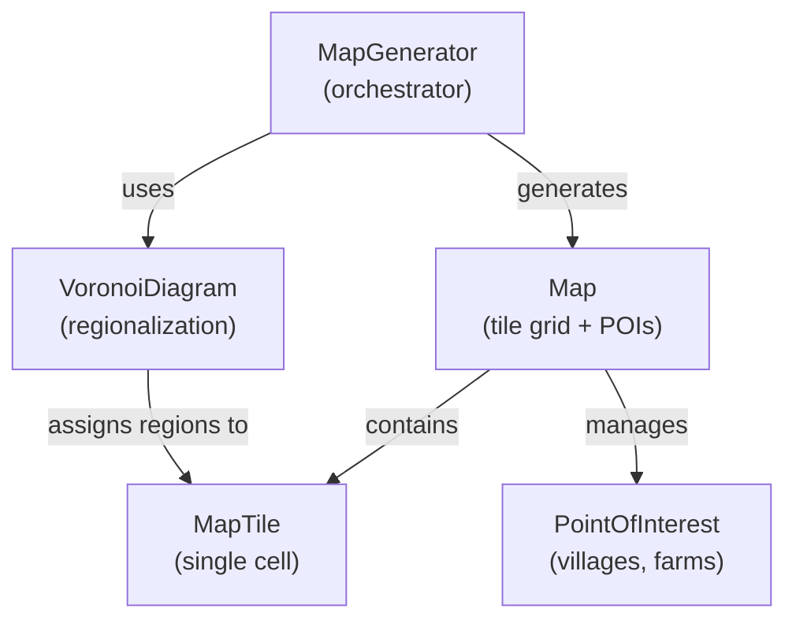
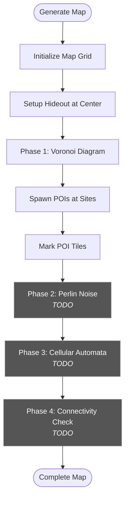
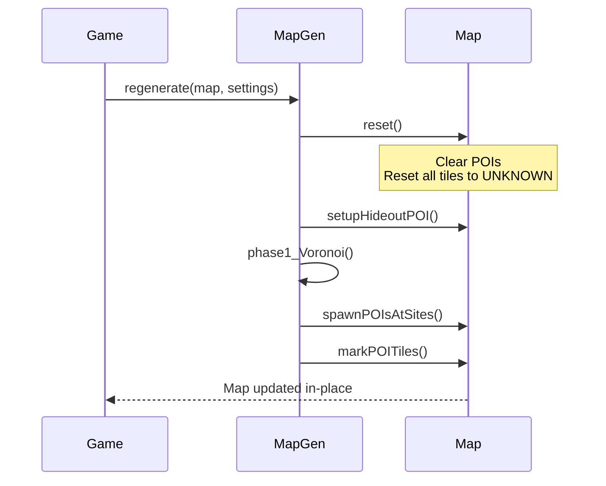

# Map System

## Overview

The Map System is responsible for creating and managing the game's procedurally generated world. It consists of a tile-based grid structure with integrated Points of Interest (POIs) and multi-phase terrain generation.

## Architecture



## Core Components

### Map
The main container for the game world, managing a 2D grid of tiles and POI locations.

**Key Responsibilities:**
- Store tile data in a 2D vector grid `[y][x]`
- Manage POI collection (villages, farms, hideout)
- Convert between world coordinates and tile coordinates
- Rendering tiles
- Track Voronoi region boundaries

**Memory Layout:**
```
Map (XxY tiles at 64px each = x*64 and y*64 world pixels)
|-- Tiles [height][width]
│   |--Each tile: 
│       - TerrainType (grass, forest, water, etc.)
│       - Walkability flag
│       - Voronoi region ID
|-- POIs (vector of unique_ptr)
    |--- Hideout, Villages, Farms
```

**Coordinate Systems:**
```cpp
// World Position → Tile Coordinates
sf::Vector2i tileCoords = map->worldToTile({4096.f, 4096.f});
// Returns: {64, 64} (tile indices)

// Tile Coordinates → World Position (center)
sf::Vector2f worldPos = map->tileToWorld(64, 64);
// Returns: {4128.f, 4128.f} (center of tile)
```

### MapTile
Individual cell in the grid with terrain and region data.

**Properties:**
```cpp
class MapTile {
    TerrainType m_terrainType;  // UNKNOWN, Grass, Forest, POI, etc.
    bool m_walkable;            // Can player traverse this tile?
    int m_voronoiRegion;        // Which region does this belong to? (-1 = none)
};
```

**Debug Rendering:** 
(To be removed and replaced with sprites)\
Each terrain type has a unique color for visualization:
- **Black**: UNKNOWN (ungenerated)
- **Light Green**: Grass
- **Dark Green**: Forest
- **Blue**: Water
- **Red**: POI (blocking areas)

### PointOfInterest (POI)
Static locations with rectangular bounds.

**Types:**
```cpp
enum class Type {
    PlayerHideout,  // Starting location (always at center)
    Village,        // Large settlement
    Farm,           // Small resource area
    Landmark        // Future use
};
```

**POI Placement Rules:**
- **Hideout**: Always at exact map center
- **Villages/Farms**: Spawned at Voronoi sites with minimum spacing
- **Blocking**: POI tiles are marked non-walkable during generation

## MapGenerator Pipeline

The generator orchestrates a multi-phase procedural generation process.



### Generation Settings

```cpp
struct GenerationSettings {
    // Map Layout
    unsigned short mapWidth = 128;       // Tiles
    unsigned short mapHeight = 128;      // Tiles
    float tileSize = 64.f;               // Pixels per tile
    
    // Voronoi Configuration
    unsigned char voronoiSites = 20;     // Number of regions
    float minSiteDistance = 400.0f;      // Min spacing (pixels)
    unsigned int seed = 0;               // Random seed (0 = random)
    
    // POI Spawning
    unsigned char numVillages = 1;
    unsigned char numFarms = 2;
};
```

### Phase 1: Voronoi Diagram (Current)

Creates distinct regions across the map by:
1. Generating random site positions (avoiding hideout)
2. Assigning each tile to its nearest site
3. Coloring tiles based on region
4. Spawning POIs at select sites

**Region Assignment Example:**
```
Given 3 sites: A(100,100), B(300,300), C(500,100)
Tile at (200, 150):
  - Distance to A: 111px
  - Distance to B: 170px
  - Distance to C: 305px
-> Tile assigned to region A
```

### Phases 2-4: Future Terrain Refinement

**Phase 2: Perlin Noise** (TODO)
- Add organic terrain density variation
- Control forest/grass distribution
- Create natural-looking terrain transitions

**Phase 3: Cellular Automata** (TODO)
- Smooth terrain boundaries
- Generate clustered forests
- Remove isolated single-tile features

**Phase 4: Connectivity Check** (TODO)
- Dijkstra map flood-fill from hideout
- Ensure all POIs are reachable
- Add paths if regions are disconnected

## Rendering System

### Vertex Array
Currently a single vertex array to be rendered, will be replaced with sprites and spactial partition to reduce GPU load.


### Voronoi Boundary Rendering
White lines drawn between tiles of different regions:

```cpp
for each tile:
    if (rightNeighbor.region != myRegion):
        Draw vertical line on right edge
    if (bottomNeighbor.region != myRegion):
        Draw horizontal line on bottom edge
```

## Map Regeneration

Maps can be regenerated at runtime with new seeds:\
### Sequence diagram


**Key Difference from Initial Generation:**
- `generate()`: Allocates new Map object
- `regenerate()`: Reuses existing memory, faster for runtime changes

## Usage Example

```cpp
// Setup generation parameters
MapGenerator::GenerationSettings settings;
settings.mapWidth = 128;
settings.mapHeight = 128;
settings.voronoiSites = 20;
settings.numVillages = 1;
settings.numFarms = 2;
settings.seed = 12345;

// Generate new map
MapGenerator generator;
std::unique_ptr<Map> map = generator.generate(settings);

// Query map data
MapTile* tile = map->getTile(64, 64);
if (tile->isWalkable()) {
    // Move player here
}

// Check POI collision
if (map->isInsidePOI(playerPos)) {
    // Player entered village
}

// Regenerate with new seed
settings.seed = 67890;
generator.regenerate(map.get(), settings);
```

## Future Extensions

- **Terrain Sprites**: Replace debug colors with textured tiles
- **Biome System**: Link terrain types to Voronoi regions (forest region, plains region)
- **Hand Held Map**: Render low-res version of entire map, with marked POIs for current map for player to know where they are.
- **Chunk Partition**: Only update and render adjacent objects in near regions, ignore far regions. 
