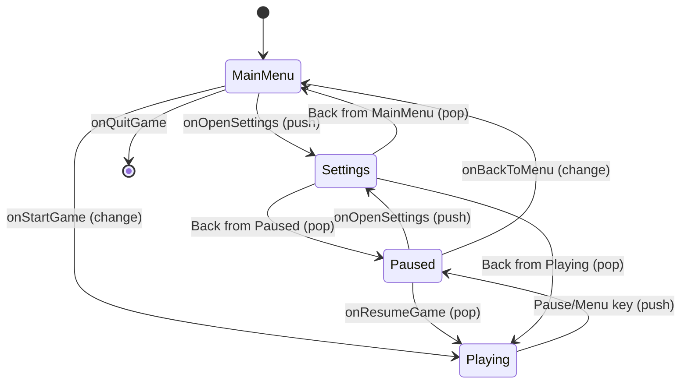

The game runs at a fixed 60 FPS update rate with unlimited render frames:


```cpp
while (window is open)
    1. processEvents()          // Handle input & window events
    2. Accumulate delta time
    3. while (time > frame_time)
        - inputController.update()
        - game.update(60fps)
    1. render()                 // Render as fast as possible
```
This ensures consistent physics and input handling across all machines.
### State Machine
The game uses a stack-based state manager with three transition types:
#### Push Transition
Pauses current state and adds new state on top.
```
Example: Playing → push Paused
Stack: [MainMenu, Playing, Paused]
Current: Paused (game rendered but frozen in background)
```
#### Pop Transition
Returns to previous state by popping from stack.
```
Example: [Playing, Paused] → pop
Stack: [Playing]
Current: Playing (resume game)
```
### State Flow Diagram


### State Callbacks
Each state transition triggers callbacks for setup/cleanup:
```cpp
onStateEnter(GameState state)  // Show UI, hide cursor, etc.
onStateExit(GameState state)   // Optional cleanup
```