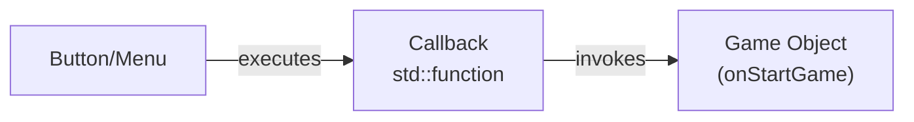

## 02 - Command Pattern

### Overview

The **Command Pattern** is used for UI button callbacks and input actions. Commands are stored as lambdas and executed later.
### Button Callback System
```cpp

// Store command as lambda
button.setCallback([this]() { onStartGame(); });
// Execute later when clicked
void ButtonComponent::update(mousePos, mousePressed) {
    if (wasClickedThisFrame) {
        if (m_callback)  // Execute stored command
            m_callback();
    }
}

```
### Example Menu Setup
```cpp
// Main Menu - each button stores a command
m_mainMenu.addButton("Start Game", [this]() { onStartGame(); });

m_mainMenu.addButton("Settings", [this]() { onOpenSettings(); });

m_mainMenu.addButton("Quit", [this]() { onQuitGame(); });

// When user clicks "Start Game":

// 1. ButtonComponent detects click

// 2. Executes stored lambda

// 3. onStartGame() is called

// 4. m_stateManager.changeState(GameState::Playing)

```
### Benefits

- **Decoupling**: Button doesn't know what it triggers
- **Flexibility**: Commands can be changed at runtime
- **Queuing**: Commands could be stored for replay or undo
### Diagram

