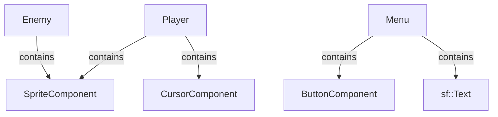

### Overview
The **Component Pattern** is used to compose game objects from reusable pieces. Player contains Sprite and Cursor components; Menu contains Button components.
### Player Composition

```cpp
class Player {

    SpriteComponent m_sprite;      // Visual representation

    CursorComponent m_cursor;      // Custom cursor during gameplay

    InputController* m_input;      // Input reference

    // Behavior

    PlayerState m_currentState;

    sf::Vector2f m_velocity;

};

// Usage

player.initialize(texturePath);

player.updateWithInput(deltaTime, input, mousePos);

player.render(target);

```
### Menu Composition

```cpp
class Menu {

    std::vector<std::unique_ptr<ButtonComponent>> m_buttons;

    sf::Text m_titleText;

    void addButton(text, callback);

    void update(input);

    void render(target);

};

```
### Benefits
- **Reusability**: SpriteComponent used by Player and Enemy

- **Flexibility**: Mix and match components

- **Separation of Concerns**: Each component handles one responsibility

### Diagram

  

