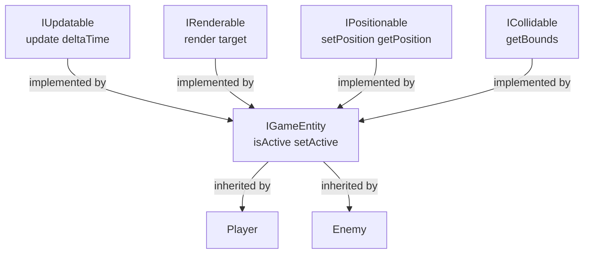

## Overview

Thorns uses **Interface Pattern** (not inheritance) to define contracts that multiple unrelated classes can implement. Instead of forcing all game objects into a rigid hierarchy, interfaces let each class adopt only the behaviors it needs.
### Interfaces vs Inheritance

**Inheritance (IS-A):**
```

Animal (base)

  ├── Dog (IS-A Animal)

  ├── Cat (IS-A Animal)

  └── Bird (IS-A Animal)

Problem: Forces Animal into one role.

If Dog needs to be Swimmable but Bird doesn't,

you either pollute Animal with swim logic or create fragile hierarchies.

```
**Interfaces (CAN-DO):**
```

IRenderable (can be drawn)

IUpdatable (can be updated)

IPositionable (can move)

ICollidable (can collide)

Player CAN-DO all of these

Enemy CAN-DO all of these

Button CAN-DO Renderable, Positionable (but not Updatable by itself)

Each class implements ONLY what it needs.

```
## THORNS Interface Hierarchy

  



  

## The Interfaces
### IUpdatable

```cpp
class IUpdatable {

public:

    virtual ~IUpdatable() = default;

    virtual void update(sf::Time deltaTime) = 0;

};

```

**Who implements it:**

- Player (needs per-frame physics updates)

- Enemy (needs per-frame movement)

- Any entity that changes over time
### IRenderable
```cpp

class IRenderable {

public:

    virtual ~IRenderable() = default;

    virtual void render(sf::RenderTarget& target) const = 0;

};

```

**Who implements it:**

- Player (draw sprite + cursor)

- Enemy (draw sprite)

- ButtonComponent (draw button shape + text)

- Menu (draw all buttons + title)

- CursorComponent (draw custom cursor)

Basically anything visible.
### IPositionable
```cpp
class IPositionable {

public:

    virtual ~IPositionable() = default;

    virtual sf::Vector2f getPosition() const = 0;

    virtual void setPosition(const sf::Vector2f& pos) = 0;

};

```

**Who implements it:**

- Player (world position)

- Enemy (world position)

- ButtonComponent (UI position)

- Menu (menu position)
- 
Anything with a location.
### ICollidable
```cpp
class ICollidable {

public:

    virtual ~ICollidable() = default;

    virtual sf::FloatRect getBounds() const = 0;

};

```
**Who implements it:**

- Player (collision detection)

- Enemy (collision detection)

- ButtonComponent (click detection)

Anything that can collide or be clicked.
### IGameEntity (Composite)
```cpp
class IGameEntity : public IUpdatable,

                    public IRenderable,

                    public IPositionable,

                    public ICollidable {

public:

    virtual ~IGameEntity() = default;

    virtual bool isActive() const = 0;

    virtual void setActive(bool active) = 0;

};
```

**Combines multiple interfaces** for "full game objects."

**Who implements it:**
- Player
- Enemy
- Any object that needs all four behaviors
## Player as Case Study
Player needs to be renderable, updatable, positionable, and collidable. Instead of forcing this through inheritance:
```cpp
// BAD: Rigid single inheritance
class Player : public GameObject {

    virtual void update() = 0;

    virtual void render() = 0;

    virtual void setPosition() = 0;

    virtual sf::FloatRect getBounds() = 0;

};

// Problem: Every game object must implement ALL methods,

// even if it doesn't need them.

```

**Better: Player explicitly declares what it is:**

```cpp
class Player : public IGameEntity {  // IGameEntity = composite of 4 interfaces

public:

    void update(sf::Time deltaTime) override;      // From IUpdatable

    void render(sf::RenderTarget& target) const override;  // From IRenderable

    void setPosition(const sf::Vector2f& pos) override;    // From IPositionable

    sf::Vector2f getPosition() const override;     // From IPositionable

    sf::FloatRect getBounds() const override;      // From ICollidable

    bool isActive() const override;                // From IGameEntity

    void setActive(bool active) override;

};

```
Now it's clear: Player can be updated, rendered, positioned, and collided with.