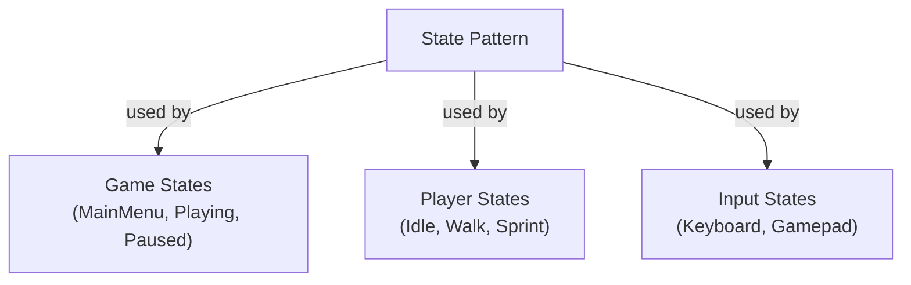

### Overview

The **State Pattern** is used in three places in THORNS:
1. **Game States** - MainMenu, Playing, Paused, Settings, GameOver
2. **Player Movement States** - Idle, Walk, Sprint
3. **Input Device States** - Keyboard vs Gamepad (which device to poll)

### Game State Implementation
```cpp
// State enum
enum class GameState {
    MainMenu, Playing, Paused, Settings
};

// State manager with stack

class GameStateManager {

    std::stack<GameState> m_stateStack;

    GameState m_currentState;

    void pushState(GameState newState);   // Pause current

    void popState();                       // Resume previous

    void changeState(GameState newState);  // Replace entirely

};

```
### Player State Implementation
```cpp
enum class PlayerState { Idle, Walk, Sprint };
// State-driven behavior

void Player::updateState() {

    bool isMoving = (moveInput != 0);

    bool isSprinting = input.isPressed(Sprint);

    PlayerState newState = isMoving ?

        (isSprinting ? Sprint : Walk) : Idle;
    if (newState != m_currentState) {
    
        changeState(newState);
    }

}

float Player::getCurrentSpeed() {

    switch (m_currentState) {

        case Idle:   return 0.f;

        case Walk:   return WALK_SPEED;

        case Sprint: return SPRINT_SPEED;

    }

}

```
### Input Device State Implementation

The InputController also uses the State Pattern to determine which device to poll:
```cpp
enum class InputDevice {

    Keyboard,   // Poll keyboard only

    Gamepad     // Poll gamepad only

};

void InputController::update(const sf::Window& window) {

    // ... save previous state ...

    // DETECT DEVICE STATE

    detectActiveDevice();

    // POLL BASED ON CURRENT STATE

    switch (m_activeDevice) {

        case InputDevice::Gamepad:

            updateGamepad();   // Poll gamepad

            break;

        case InputDevice::Keyboard:

            updateKeyboard();  // Poll keyboard

            break;

    }

    updateMouse(window);  // Always update mouse

}

```

**Why?** This avoids polling both devices every frame. If keyboard is active, we skip expensive gamepad checks. When a gamepad plugs in, `detectActiveDevice()` switches states automatically.
### Diagram

  

