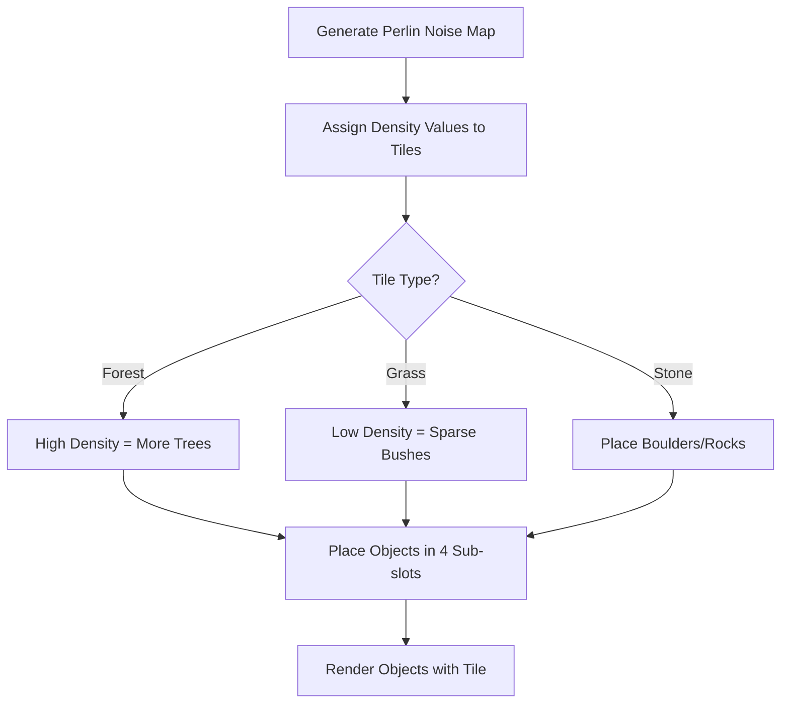
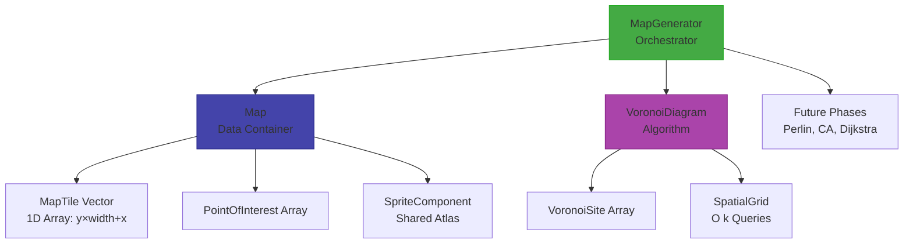

# THORNS - Project Presentation
---

## 1. What Has Been Completed

### Core Game Systems
- :white_check_mark: **Fixed timestep game loop** (60 FPS update)
  - Might add setting to allow user to change this in the settings when game runs.
- :white_check_mark: **State machine architecture** (MainMenu, Playing, Paused, Settings, GameOver)
- :white_check_mark: **Stack-based state manager** (push/pop/change transitions)
- :white_check_mark: **Input abstraction layer** (keyboard + gamepad support, rebindable keys)
- :white_check_mark: **Component-based architecture** (SpriteComponent, CursorComponent, ButtonComponent)
- :white_check_mark: **Interface pattern implementation** (IUpdatable, IRenderable, IPositionable, ICollidable)

### UI & Settings
- :white_check_mark: **Main menu system** (Start, Settings, Quit)
- :white_check_mark: **Pause menu** (Resume, Settings, Main Menu, Quit)
- :white_check_mark: **Settings menu** with key rebinding
- :white_check_mark: **Fullscreen toggle**
  - Note: Working on how to add screen resolution also for variable adjustments.
- :white_check_mark: **Inventory framework** (10-slot grid, hover detection)
  - Note: Slight error in current rendering, can showcase if needed.

### Player & Entities
- :white_check_mark: **Player state machine** (Idle, Walk, Sprint, InventoryOpen)
- :white_check_mark: **Mouse-facing rotation**
- :white_check_mark: **Custom cursor rendering** (replaces OS cursor during gameplay)
  - Using SFML circle: Will be changed to a custom asset when I can.
- :white_check_mark: **Camera system** (follows player, clamped to map bounds)

### Procedural Map Generation
- :white_check_mark: **Tile-based grid system** (2D array, coordinate conversion)
- :white_check_mark: **Points of Interest (POIs)** (Hideout, Villages, Farms... more to be added)
- :white_check_mark: **Voronoi diagram regionalization** (Poisson disk sampling)
- :white_check_mark: **Spatial grid optimization** (O(k) [to subset data] lookups instead of O(n))
- :white_check_mark: **Map regeneration system** (new seed at runtime)
- :white_check_mark: **Texture atlas rendering** (shared sprite for all terrain tiles)
  - Was having a small issue of memory overload which is fixed now.
- :white_check_mark: **Frustum culling** (only render visible tiles/POIs)

---

## 2. Currently In Progress (~30% Complete)

### Map Generator - Phase 1 Complete, Phases 2-4 Remaining


**Phase 1 (Voronoi)**: COMPLETE
- Sites placed with Poisson disk sampling
- Tiles assigned to nearest region
- POIs spawned at select sites
- Boundaries visualized

**Phase 2 (Perlin Noise)**: In Progress
- Will add organic terrain variation
- Control forest/grass density per region
- Create natural-looking transitions between terrain types

**Phase 3 (Cellular Automata)**: TODO
- Smooth terrain boundaries
- Generate clustered forests (remove isolated tiles)
- Refine POI borders

**Phase 4 (Connectivity)**: TODO
- Dijkstra map flood-fill from hideout
- Ensure all POIs are reachable by player
- Add connecting paths if regions are isolated

---

## 3. Next Development Phase

### Perlin Noise Integration + Object Placement System

#### Terrain Detail System
Each tile will support **4 sub-tile object placements**:

| Slot | Position |
|------|----------|
| 1    | Top-Left |
| 2    | Top-Right |
| 3    | Bottom-Left |
| 4    | Bottom-Right |

**Grass Tile (64x64px)** - Slots for:
- Trees (Forest tiles)
- Rocks (Stone tiles)
- Bushes (Grass tiles)
- Flowers (Grass tiles)

#### Implementation Plan


**Why 4 Slots?**
- Allows natural-looking variation (not every forest tile is identical)
- Can mix object types (3 trees + 1 rock)

#### Object Sprite System
- Load sprite atlas for objects (trees, rocks, bushes)
- Each object uses `SpriteComponent` positioned at sub-tile offset
- Objects rendered **after** base terrain, **before** entities

---

## 4. Most Complicated System & Challenges

### Map Generation System Architecture

**The Challenge**: Building a flexible procedural generation pipeline from scratch

#### System Architecture Overview



#### Breaking Down the Core Components

**1. The Foundation Problem**
- Needed a system that could generate different map layouts each time
- Had to coordinate multiple generation phases (Voronoi, Perlin, Cellular Automata)
- Each phase depends on the previous phase completing correctly
- Require/Requiring understanding of multiple algorithms and how they interact

**2. Architectural Decisions**
- **MapGenerator** as the orchestrator (runs all phases in sequence)
  - Thinking of making this a new project as a static libary, current file management might get harder to read later down the road.
- **Map** as the data container (holds tiles, POIs, manages queries)
- **MapTile** as the single unit (stores terrain type, walkability, region data)
- **VoronoiDiagram** as a separate algorithm class (handles site generation and assignment)

**3. Data Structure Challenges**
- **1D Array Storage**: `m_tiles[y × width + x]` for cache locality and simple memory management
- **Shared Sprite**: ONE texture atlas repositioned per tile (2GB → 50MB memory reduction)
- **Spatial Grid**: Hash map for O(k) nearest-neighbor queries instead of O(n)
- **Seed Management**: Reproducible generation across all phases

**4. Integration Points**
- Map must know about POIs BEFORE generation (to exclude them)
- Voronoi must assign tiles WITHOUT overwriting POI areas
- Each generation phase must respect the previous phase's data
- Camera and collision systems need to query tiles efficiently
  - When collision is added, need to think about how to set up the prefabs correctly.

**5. Seed Management**
- All random generation must use the same seed for reproducibility
- Seed must be passable between regeneration calls
- RNG state must be consistent across all phases

---

### Algorithm Optimization: Poisson vs Rejection Sampling

**Requirement**: Place Voronoi sites evenly across the map without clustering

**Rejection Sampling** (Initial approach):
- Pick random position, check distance to ALL existing sites
- Reject if too close to any site
- Performance: O(n^2) - gets exponentially slower with more sites

**Poisson Disk Sampling** (Current approach):
- Use spatial grid to only check nearby sites (3x3 cell neighborhood)
- Performance: O(k) - constant time per check
- Result: 6x faster (2500ms -> 400ms for 128x128 map)


---

### Why Optimization After Each Phase Matters

**The Dependency Chain Problem**:

```
Voronoi -> Perlin (depends on regions) -> Cellular (depends on terrain) -> Dijkstra (depends on walkability)
```

**If Voronoi is slow**:
1. Map generation feels sluggish to the player
2. Future phases are bottlenecked (can't start until Voronoi completes)
3. Testing iteration time increases (waiting 3+ seconds per test, for example)

**Optimization Strategy**:
- Profile each phase independently
- Optimize bottlenecks BEFORE building dependent phases
- Ensures each phase runs in <500ms for responsive gameplay

---

### Research & References

**Voronoi Diagrams**:
- GeeksforGeeks: Voronoi Diagram Basics
- Leatherbee.org: Terrain Generation with Voronoi

**Poisson Disk Sampling**:
- Robert Bridson's Paper (SIGGRAPH 2007): Fast Poisson Disk Sampling
- Sebastian Lague YouTube: "[Unity] Procedural Object Placement (E01: poisson disc sampling)" - https://www.youtube.com/watch?v=7WcmyxyFO7o

**Optimization Techniques**:
- The Cherno: unordered_map vs map Performance
- Game Programming Patterns: Spatial Partition

**Next Phase Research (Perlin Noise)**:
- To look up reference papers
- Video guides or site references
